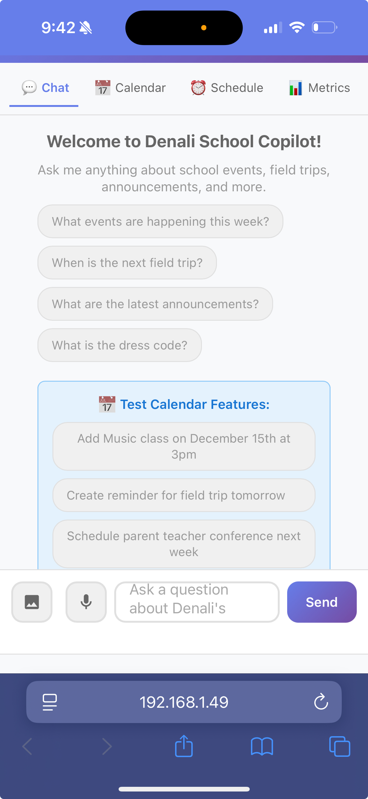

# 📘 Denali School Copilot — MVP (v0.1)

A personal assistant that organizes school-related communication by:
1. Pulling relevant emails from Gmail
2. Extracting email bodies + attachments
3. Uploading all extracted files to Gemini File Search Store
4. Allowing natural-language Q&A over the indexed documents

## Screenshots

### Chat Interface


*Main chat interface with mobile-responsive design and tabs*

### Features View


*App showing calendar and schedule features*

### Mobile View


*Mobile view of the app showing chat interface on iPhone*

## Setup

1. **Install dependencies:**
   ```bash
   python3 -m venv .venv
   source .venv/bin/activate
   pip install -r requirements.txt
   ```

2. **Configure OAuth credentials:**
   - Create OAuth client ID in Google Cloud Console (Desktop app type)
   - Save as `credentials.json` in project root

3. **Configure environment:**
   - Copy `.env.example` to `.env`
   - Fill in your values:
     - `GOOGLE_API_KEY`: Your Gemini API key from https://aistudio.google.com/app/apikey
     - `FILE_SEARCH_STORE_NAME`: Will be set after running init script
     - `SCHOOL_DOMAINS`: Comma-separated list of email domains to filter
     - `SCHOOL_SENDERS`: Comma-separated list of specific sender emails
     - `GMAIL_CLIENT_ID` and `GMAIL_CLIENT_SECRET`: From credentials.json

4. **Initialize File Search Store:**
   ```bash
   python -m scripts.init_file_search_store
   ```
   Copy the output store name into `.env` under `FILE_SEARCH_STORE_NAME`

5. **Ingest emails and upload to Gemini:**
   ```bash
   python -m app.ingest_emails
   python -m scripts.backfill_emails
   ```

6. **Start the API server:**
   ```bash
   uvicorn app.main:app --reload
   ```

7. **Access the Web UI:**
   Open your browser and go to:
   ```
   http://127.0.0.1:8000
   ```
   You'll see a beautiful chat interface where you can ask questions about Denali's school!

8. **Test the chat endpoint (via API):**
   ```bash
   curl -X POST http://127.0.0.1:8000/chat \
     -H "Content-Type: application/json" \
     -d '{"question": "What is happening at Denali'\''s school this week?"}'
   ```

## Project Structure

```
school-copilot/
  app/
    config.py              # Configuration management
    gmail_client.py        # Gmail OAuth and email fetching
    ingest_emails.py       # Email ingestion script
    gemini_file_search.py  # Gemini File Search operations
    rag_chat.py           # RAG chat implementation
    main.py               # FastAPI application
  scripts/
    init_file_search_store.py  # Initialize File Search Store
    backfill_emails.py         # Bulk upload emails and attachments
  data/
    raw_emails/           # Extracted email bodies
    attachments/          # Email attachments
```

## Features

- ✅ Gmail ingestion for specific domains/senders
- ✅ Extract and save email bodies as `.txt`
- ✅ Extract and save attachments (PDFs, images, etc.)
- ✅ Upload all files to Gemini File Search Store
- ✅ Natural language Q&A via `/chat` endpoint
- ✅ **Web UI** - Beautiful chat interface for testing

## Deployment

### Quick Deploy Options

**Render.com** (Recommended - Free tier available):
- See `DEPLOY_RENDER.md` for step-by-step instructions
- Free tier: 750 hours/month
- Auto-deploys on git push

**Railway.app** (Always-on option):
- See `DEPLOY_RAILWAY.md` for step-by-step instructions
- Free tier: $5 credit/month
- No sleep mode

### Environment Variables for Production

```
ENVIRONMENT=production
GOOGLE_API_KEY=your_gemini_api_key
FILE_SEARCH_STORE_NAME=your_store_name
SCHOOL_DOMAINS=example.com
SCHOOL_SENDERS=teacher@example.com
EMAIL_INGESTION_TIME=18:00
CORS_ORIGINS=https://your-app.onrender.com
```

## User Guide

For end users (family members), see `USER_GUIDE.md` for instructions on how to use the app.

## Features

- ✅ Gmail ingestion for specific domains/senders
- ✅ Extract and save email bodies as `.txt`
- ✅ Extract and save attachments (PDFs, images, etc.)
- ✅ Upload all files to Gemini File Search Store
- ✅ Natural language Q&A via `/chat` endpoint
- ✅ **Web UI** - Beautiful chat interface
- ✅ **Mobile-responsive** - Works on phones, tablets, desktops
- ✅ **Voice input** - Ask questions by voice
- ✅ **Calendar integration** - Add events to Google Calendar
- ✅ **Image upload** - Extract dates from conversation screenshots
- ✅ **Email notifications** - Get notified about new emails
- ✅ **Self-improvement metrics** - Track RAG performance

